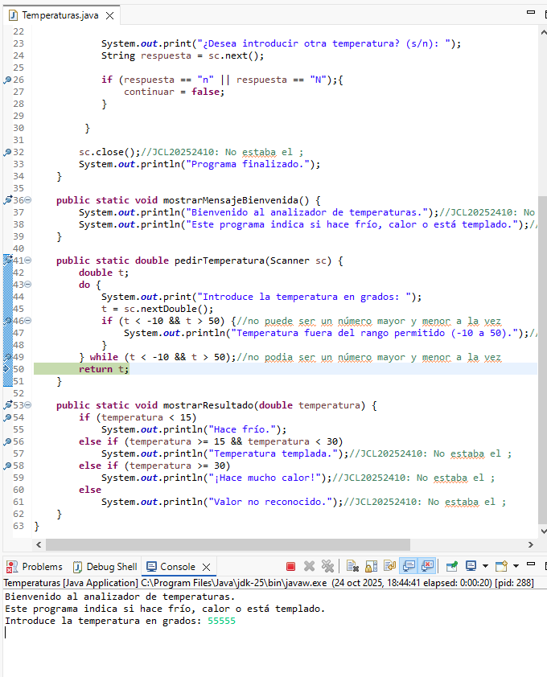

## P6 - Depura y corrige los errores

# Pantallazo de un error

# ¿Por qué ocurria el error?

Ocurria porque no puede ser un número mayor que 50 y menor que -10 a la vez.

# ¿Cómo solucione el error?

Lo solucione cambiando el && por el || en las 2 que tenian &&. Y con eso si tiene sentido, ya que un número si puede ser mayor que 50 o menor que -10.

# ¿Piensas que la documentación de un programa es necesaria? Justifica la respuesta

Si, porque gracias a eso si el programa cambia o se debe actualizar, con la documentación puedes entender tu o otro programador más rapidamente que hace cada parte del código. Esto mejora el trabajo en equipo y acelera la depuración.

**Hecho por: Jhonatan Cano León**
